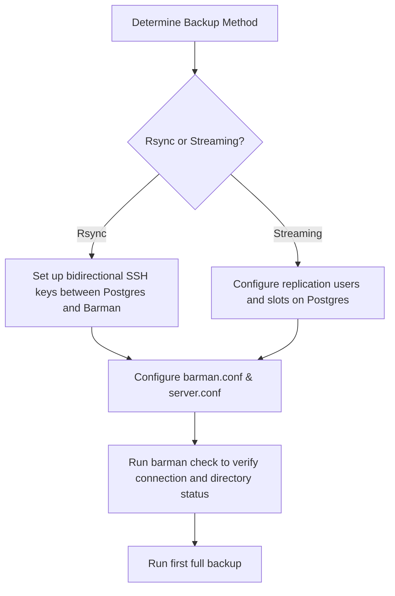
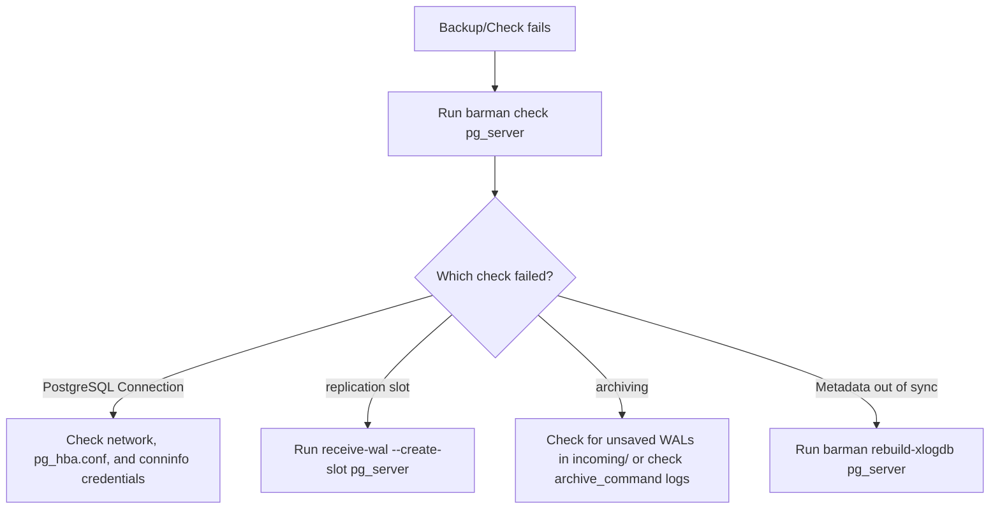

# Barman Production Runbook

This runbook details step-by-step operational procedures for onboarding, managing, and recovering PostgreSQL instances using **Barman 3.19.1**.

---

## 1. Architectural Blueprint & Server Onboarding

Barman supports two primary architectural patterns: **Rsync/SSH** (file-based) and **Streaming** (network streaming). Before initiating backups, the primary Postgres database and the Barman server must be configured to communicate.

### Onboarding Steps Checklist



### Scenario 1: Rsync/SSH Onboarding (File-Based)

This method relies on SSH for copying data directories and executing remote scripts. It uses PostgreSQL's low-level backup API (`pg_backup_start` / `pg_backup_stop`).

1. **SSH Key Exchange**:
   - The `barman` user on the Barman host must have passwordless SSH access to the `postgres` user on the PostgreSQL host:
     ```bash
     # On Barman Host
     ssh-copy-id -i ~barman/.ssh/id_rsa.pub postgres@pg_host
     ```
   - The `postgres` user on the PostgreSQL host must have passwordless SSH access to the `barman` user on the Barman host (required for WAL archiving):
     ```bash
     # On PostgreSQL Host
     ssh-copy-id -i ~postgres/.ssh/id_rsa.pub barman@barman_host
     ```
2. **PostgreSQL Configuration (`postgresql.conf`)**:
   ```ini
   wal_level = replica
   archive_mode = on
   archive_command = 'rsync -a %p barman@barman_host:/var/lib/barman/pg_server/incoming/%f'
   ```
3. **Barman Server Configuration (`/etc/barman.d/pg_server.conf`)**:
   ```ini
   [pg_server]
   description = "Postgres Main Cluster via Rsync"
   active = true
   backup_method = rsync
   ssh_command = ssh postgres@pg_host
   conninfo = host=pg_host user=barman dbname=postgres
   archiver = true
   ```

---

### Scenario 2: Streaming Onboarding (Network-Based)

This method uses Postgres streaming replication protocols via `pg_basebackup` and `pg_receivewal`. It does **not** require SSH for backup transport.

1. **PostgreSQL Users & Privileges**:
   - Create a dedicated superuser or replication user on PostgreSQL:
     ```sql
     CREATE USER barman WITH SUPERUSER PASSWORD 'secure_password';
     ```
   - Ensure the user is allowed to connect via `pg_hba.conf` for both standard and replication connections:
     ```ini
     # pg_hba.conf
     host    all             barman          barman_host/32        scram-sha-256
     host    replication     barman          barman_host/32        scram-sha-256
     ```
2. **PostgreSQL Configuration (`postgresql.conf`)**:
   ```ini
   wal_level = replica
   max_wal_senders = 10
   max_replication_slots = 10
   ```
3. **Barman Server Configuration (`/etc/barman.d/pg_server.conf`)**:
   ```ini
   [pg_server]
   description = "Postgres Main Cluster via Streaming"
   active = true
   backup_method = postgres
   conninfo = host=pg_host user=barman dbname=postgres password=secure_password
   streaming_conninfo = host=pg_host user=barman dbname=postgres password=secure_password
   streaming_archiver = true
   slot_name = barman_pg_slot
   create_slot = auto
   ```
4. **Initialize WAL Streaming**:
   Create the replication slot and start the WAL receiver:
   ```bash
   barman receive-wal --create-slot pg_server
   barman receive-wal pg_server &
   ```
   > [!NOTE]
   > In systemd-managed installations, the receive-wal process is handled automatically by the `barman` service or cron.

---

## 2. WAL Archiving Setup

Continuous WAL archiving is the foundation of Point-in-Time Recovery. Barman provides two methods:

### Option A: `barman-wal-archive` (Recommended)

Using the `barman-wal-archive` utility (from the `barman-cli` package) provides client-side integrity checks and robust error handling.

1. **PostgreSQL Configuration**:
   ```ini
   # postgresql.conf
   archive_command = 'barman-wal-archive barman_host pg_server %p'
   ```
2. **Verification**:
   Execute the test command from the **Postgres host** as the `postgres` user:
   ```bash
   barman-wal-archive --test barman_host pg_server DUMMY
   # Expected Output: Ready to accept WAL files for the server pg_server
   ```

### Option B: Rsync over SSH

Standard file transfer via `rsync` over SSH.

1. **PostgreSQL Configuration**:
   ```ini
   # postgresql.conf
   archive_command = 'test $(/bin/hostname --fqdn) = pg-production.local && rsync -a %p barman@barman_host:/var/lib/barman/pg_server/incoming/%f'
   ```
   > [!TIP]
   > The `test $(/bin/hostname --fqdn)` safeguard prevents a cloned database server from overwriting production WALs in the Barman host.

---

## 3. Zero-RPO (Synchronous WAL Streaming)

To achieve a Recovery Point Objective (RPO) of zero, Barman's WAL streaming receiver can act as a synchronous replication standby.

1. **Identify the Streaming Name**:
   Find the replication application name:
   ```bash
   barman show-servers pg_server | grep streaming_archiver_name
   # Output: streaming_archiver_name: barman_receive_wal
   ```
2. **Enable Synchronous Replication in Postgres (`postgresql.conf`)**:
   ```ini
   synchronous_standby_names = 'barman_receive_wal'
   ```
   Reload PostgreSQL: `pg_ctl reload` or `SELECT pg_reload_conf();`.
3. **Verify Synchronous State**:
   ```bash
   barman replication-status pg_server
   # Verify that the receive-wal process shows status "sync"
   ```

> [!WARNING]
> **Production Caveat**: Because replication is synchronous, if the Barman server becomes unreachable or its `receive-wal` process stops, all write operations on the primary PostgreSQL instance will block. Monitor Barman availability closely.

---

## 4. Backup Lifecycle Management

### 4.1 Running Backups

* **Standard Backup**:
  ```bash
  barman backup pg_server
  ```
* **Parallel Workloads**:
  To speed up copying for large databases, use multiple parallel jobs:
  ```bash
  barman backup --jobs 4 pg_server
  ```

### 4.2 Incremental Backups

#### Block-Level Incremental Backups (PG 17+)
Block-level incrementals copy only modified database pages.

1. **Postgres Pre-requisites**:
   Enable WAL summarization in `postgresql.conf`:
   ```ini
   summarize_wal = on
   ```
2. **Execute Initial Full Backup**:
   ```bash
   barman backup pg_server
   ```
3. **Execute Incremental Backup**:
   Use `last-full` or `latest-full` to link to the last complete base backup:
   ```bash
   barman backup --incremental last-full pg_server
   ```

#### File-Level Incremental Backups (Rsync-only)
File-level incrementals reuse previous backups via hard links.

1. **Configure in `pg_server.conf`**:
   ```ini
   reuse_backup = link
   ```
2. **Run Backup**:
   ```bash
   barman backup pg_server
   ```
   *(Or override at runtime: `barman backup --reuse-backup=link pg_server`)*

### 4.3 Retention & Archiving Policies

1. **Configure Retention**:
   Define retention policies in `barman.conf` or the server config:
   ```ini
   # Keep backups for 14 days
   retention_policy = RECOVERY WINDOW OF 14 DAYS
   # Keep only the last 3 backups
   # retention_policy = REDUNDANCY 3
   
   retention_policy_mode = auto
   wal_retention_policy = main
   ```
2. **Pinning Backups (`keep`)**:
   Pinning prevents a backup from being pruned by retention policies (e.g. quarterly archival backups):
   ```bash
   # Pin Backup
   barman keep --target full pg_server 20260716T080000
   
   # Release Pin
   barman keep --release pg_server 20260716T080000
   ```
3. **Cron Enforcement**:
   Ensure `barman cron` runs via standard crontab to enforce retention policies and execute cleanup:
   ```cron
   # /etc/cron.d/barman
   * * * * * barman [ -x /usr/bin/barman ] && /usr/bin/barman cron > /dev/null
   ```

---

## 5. Recovery & Point-in-Time Recovery (PITR)

When recovering, backups are extracted to a target directory. Recovery targets instruct Postgres to roll forward WALs and stop at a specific point.

### Staging Directories for Incremental/Compressed Restores

For restores that require decompression or combining incremental chains, intermediate staging space is required.

> [!WARNING]
> `--local-staging-path` and `--recovery-staging-path` are deprecated in 3.15. Use `--staging-path` and `--staging-location` instead.

```bash
# Example restoring compressed/incremental backup using a remote staging path
barman restore --staging-path /tmp/staging --staging-location remote pg_server 20260716T080000 /var/lib/postgresql/17/main
```

---

### Step-by-Step Recovery Workflows

#### 5.1 Local Recovery (Postgres runs on Barman host)

1. **Stop PostgreSQL**:
   ```bash
   sudo systemctl stop postgresql
   ```
2. **Execute Restore**:
   Run the restore command. Use `--get-wal` to enable dynamic WAL fetching.
   ```bash
   barman restore --get-wal pg_server 20260716T080000 /var/lib/postgresql/17/main
   ```
3. **Configure Sudo Permissions**:
   Since the restore command configures Postgres to fetch WALs as the `barman` user using `barman get-wal`, you must authorize the `postgres` user to run `barman get-wal` without a password. Add the following to `/etc/sudoers`:
   ```text
   postgres ALL=(barman) NOPASSWD: /usr/bin/barman get-wal pg_server *
   ```
   This allows PostgreSQL to execute:
   `restore_command = 'sudo -u barman barman get-wal pg_server %f %p'`
4. **Start PostgreSQL**:
   ```bash
   sudo systemctl start postgresql
   ```

---

#### 5.2 Remote Recovery (Postgres runs on remote host)

1. **Prepare Remote Directory**:
   Ensure the remote host database directory `/var/lib/postgresql/17/main` is empty and owned by the `postgres` user.
2. **Execute Remote Restore**:
   Initiate restoration from the Barman host, specifying the remote SSH target command:
   ```bash
   barman restore --remote-ssh-command "ssh postgres@target_host" --get-wal pg_server 20260716T080000 /var/lib/postgresql/17/main
   ```
3. **WAL Fetching (`barman-wal-restore`)**:
   Using `--get-wal` configures PostgreSQL's `restore_command` to dynamically fetch WALs from the Barman server over SSH using `barman-wal-restore`:
   ```ini
   # Generated in /var/lib/postgresql/17/main/postgresql.auto.conf
   restore_command = 'barman-wal-restore -U barman barman_host pg_server %f %p'
   ```
   Verify target-to-barman connectivity:
   ```bash
   # Run on Target Host as postgres user
   barman-wal-restore --test barman_host pg_server DUMMY DUMMY
   # Expected Output: Ready to retrieve WAL files from the server pg_server
   ```
4. **Start Remote Postgres**:
   ```bash
   systemctl start postgresql
   ```

---

#### 5.3 Point-in-Time Recovery (PITR) Execution

To recover to a specific timestamp, transaction ID (XID), or LSN:

1. **Identify the Backup ID**:
   ```bash
   barman list-backups pg_server
   ```
2. **Run Restore with PITR Target**:
   ```bash
   barman restore \
     --remote-ssh-command "ssh postgres@target_host" \
     --get-wal \
     --target-time "2026-07-16 10:45:00.000" \
     --target-action promote \
     pg_server 20260716T080000 /var/lib/postgresql/17/main
   ```
3. **Signal Files (Postgres 12+)**:
   Barman automatically creates the required signal files in the destination directory:
   - **`recovery.signal`**: Created when a `--target-*` option is specified, forcing Postgres into recovery mode until the target is reached.
   - **`standby.signal`**: Created when `--standby-mode` is specified, keeping the server in read-only standby mode (streaming updates).
4. **Start PostgreSQL and Monitor Log**:
   ```bash
   tail -f /var/log/postgresql/postgresql.log
   ```
   Postgres will retrieve WAL files, roll forward until the target timestamp is hit, execute the `--target-action` (in this case, promote to primary), and delete `recovery.signal`.

---

## 6. Troubleshooting & Maintenance

### 6.1 Diagnostic Workflow



### 6.2 Common Failures & Resolutions

#### Check Failure: `archiving: FAILED`
* **Cause**: `archiver = off` in configuration, but WAL files exist in the `incoming/` directory. This happens if the archiver was turned off but Postgres' `archive_command` is still sending files.
* **Resolution**: Determine if the files in `incoming/` are required. If they are older than the oldest active backup, they can be deleted. Once the directory is empty, the check will pass.

#### WAL Database Corruption
* **Symptoms**: Errors during WAL checks, backup listing delays, or errors during recovery about missing WAL files.
* **Resolution**: Rebuild the WAL metadata database:
  ```bash
  barman rebuild-xlogdb pg_server
  ```

#### Handle Duplicate WAL Mismatch
* **Symptoms**: Warnings about archiver errors in `barman check`.
* **Cause**: `barman-wal-archive` sent a duplicate WAL file. If the content matches, it is ignored. If the content differs, it is moved to the `errors_directory`.
* **Resolution**: Inspect the errors directory (defined by `errors_directory`, defaults to `/var/lib/barman/pg_server/errors/`). Compare hashes of the files and remove/replace if necessary.

### 6.3 NFS Mount Best Practices
If the Barman backup directory (`barman_home`) is mounted via NFS:
1. **Local Lock Directory**: The locking directory must **not** be on NFS. Configure it locally:
   ```ini
   # barman.conf
   barman_lock_directory = /var/run/barman
   ```
2. **NFS Version**: Use at least **NFSv4**.
3. **Mount Options**: Ensure NFS is mounted with `hard` and `sync` options in `/etc/fstab`:
   ```text
   nfs_server:/backups /var/lib/barman nfs4 rw,relatime,vers=4.2,hard,sync,proto=tcp 0 0
   ```
