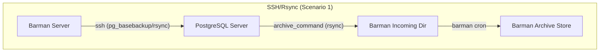
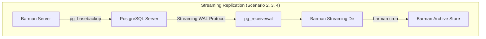

# Barman Workshop: Step-by-Step Lab Workbook

Welcome to the hands-on lab workbook for the **PostgreSQL Barman Backup & Recovery Workshop**. This guide walks you through the concepts, configurations, execution steps, and disaster recovery processes across four realistic database scenarios.

---

## Table of Contents
1. [Core Concepts & Architecture](#core-concepts--architecture)
2. [Scenario 1: Classic SSH/Rsync Backups](#scenario-1-classic-sshrsync-backups)
3. [Scenario 2: Streaming Replication Backups](#scenario-2-streaming-replication-backups)
4. [Scenario 3: Point-in-Time Recovery (PITR) & Disaster Recovery](#scenario-3-point-in-time-recovery-pitr--disaster-recovery)
5. [Scenario 4: Retention Policies & Backup Pinning](#scenario-4-retention-policies--backup-pinning)
6. [Best Practices in Production](#best-practices-in-production)

---

## Core Concepts & Architecture

Before diving into the labs, it is crucial to understand the two main patterns of Barman integration with PostgreSQL:





### Key Differences Reference

| Feature | RSYNC / SSH Method | Streaming Method |
| :--- | :--- | :--- |
| **Connection Protocol** | SSH and Standard PG Connection | PG Replication Protocol (TCP 5432) |
| **WAL Delivery** | Pushed by PG via `archive_command` | Pulled by Barman via `pg_receivewal` |
| **Backup Command** | File-level copy via SSH/rsync | Physical copy via `pg_basebackup` |
| **RPO (Recovery Point Objective)** | Up to 16MB WAL segment size (unless archive timeout set) | Near zero (real-time transaction streaming) |
| **SSH Required?** | Yes, both ways | No (only required for remote restoration) |

---

## Scenario 1: Classic SSH/Rsync Backups

This scenario demonstrates the traditional method of backing up PostgreSQL. The PostgreSQL server "pushes" WAL files to Barman using SSH, and Barman retrieves physical file-level backups over SSH.

### 1. Boot up the Lab
Change directory and launch the environment:
```bash
cd scenario-1-rsync-ssh
make up
```

### 2. Verify Barman Check status
Run the health check command:
```bash
make check
```
**Expected Output:**
All checks should report `OK`. Notice the `ssh: OK` and `archive_command: OK` entries, verifying that SSH keys are correctly generated and the system can exchange files.

### 3. Trigger a Full Backup
Create a full physical copy of the database:
```bash
make backup
```

### 4. Verify Backup Catalog
List the backup files currently available:
```bash
make list-backups
```
**Expected Output:**
```
pg 20260710T120000 - Fri Jul 10 12:00:00 2026 - Size: 22.2 MiB - WAL Size: 0 B
```

---

## Scenario 2: Streaming Replication Backups

In this scenario, Barman acts as a streaming standby. It connects to the PostgreSQL database over the replication protocol, streams transactions live via `pg_receivewal`, and takes backups using `pg_basebackup` without needing SSH keys for backup collection.

### 1. Boot up the Lab
Ensure you are in the correct scenario directory:
```bash
cd ../scenario-2-streaming
make up
```

### 2. Check the Status
Run:
```bash
make check
```
**Pedagogical Note:** During early bootstrap, the Makefile automatically triggers `barman switch-wal --force pg` followed by `barman cron`. This generates the initial WAL file, streams it via `pg_receivewal`, and archives it to satisfy Barman's startup checks.

### 3. Inspect Status Information
Get a detailed overview of the server setup:
```bash
make status
```
Observe that:
- `backup_method` is set to `postgres`
- `streaming_archiver` is `on`
- A physical replication slot named `barman` is active.

### 4. Perform a Backup
```bash
make backup
```

---

## Scenario 3: Point-in-Time Recovery (PITR) & Disaster Recovery

This lab demonstrates how to recover a database to an exact moment in the past—specifically, right before a user mistakenly drops a table.

### 1. Boot up the Lab
```bash
cd ../scenario-3-pitr-disaster
make up
```

### 2. Run the Automated PITR Simulation
Execute the PITR demonstration:
```bash
make run-pitr-demo
```

### Under the Hood: What the Demo Script Does

1. **Creates Baseline Data:**
   Inserts a record (`'Baseline data'`) into a table called `test_pitr`.
2. **Takes Initial Backup:**
   Captures the state of the database containing the baseline data.
3. **Inserts Important Data:**
   Inserts a second record (`'Important data (keep)'`).
4. **Creates Named Restore Point:**
   Executes `SELECT pg_create_restore_point('before_disaster');`. This marks the transaction log with a custom alias.
5. **Forces WAL Switch:**
   Runs `SELECT pg_switch_wal();` and triggers `barman cron` to ensure the restore point is written and archived in Barman's repository.
6. **Simulates Disaster:**
   Drops the `test_pitr` table.
7. **Performs PITR Recovery:**
   Restores the base backup to a temporary directory `/var/lib/postgresql/recovered-data` with target parameters set to the restore point:
   `barman recover --target-name before_disaster pg <backup_id> /var/lib/postgresql/recovered-data`
8. **Validates Recovered Instance:**
   Launches the recovered database on port `5433` and executes:
   `SELECT val FROM test_pitr;`
   Confirming that BOTH the baseline data and the important data are present, but the table dropping (disaster) is avoided!

---

## Scenario 4: Retention Policies & Backup Pinning

Storage management is critical in production. This lab demonstrates how to configure retention policies and "pin" (keep) specific backups to prevent automated pruning.

### 1. Boot up the Lab
```bash
cd ../scenario-4-retention-maintenance
make up
```

### 2. Run the Retention Demo
Execute the retention demonstration:
```bash
make run-retention-demo
```

### Under the Hood: How Retention Works

- **Retention Configuration:**
  In `barman/pg.conf`, the policy is defined as:
  `retention_policy = REDUNDANCY 2`
  This tells Barman to keep at most the last 2 backups. Older backups will be marked as obsolete.
- **Pinning a Backup:**
  To override the retention policy for a critical backup (e.g., a year-end or pre-migration snapshot), use:
  `barman keep --target full pg <backup_id>`
  This pins the backup indefinitely.
- **Enforcement (`barman cron`):**
  When `barman cron` runs, it scans the catalog. Obsolete backups are deleted *unless* they are pinned.
- **Releasing a Pin:**
  When a pinned backup is no longer needed, release it:
  `barman keep --release pg <backup_id>`
  On the next `barman cron` execution, it will be automatically pruned.

---

## Best Practices in Production

When deploying PostgreSQL Barman in production, keep the following guidelines in mind:

1. **Dedicated Network/VLAN:** Ensure the replication and backup traffic (which can be very IO/network intensive) uses a dedicated interface or VLAN to avoid affecting production client queries.
2. **Dedicated Storage (SAN/NAS):** Barman stores compression-heavy full backups and WAL history. Configure dedicated, high-performance disks with RAID or remote block storage.
3. **Automate Checkups:** Schedule `barman cron` to run at least every minute (for processing incoming WALs and enforcing retention), and set up alerts for failing health checks (`barman check pg`).
4. **Test Restores Regularly:** A backup is only as good as its restore. Use the patterns shown in Scenario 3 to spin up temporary recovered instances programmatically and verify their integrity.

---

### Clean Up the Labs
To clean up all environments and ensure no Docker networks or volumes are left running:
```bash
# Inside any scenario directory
make clean
```
